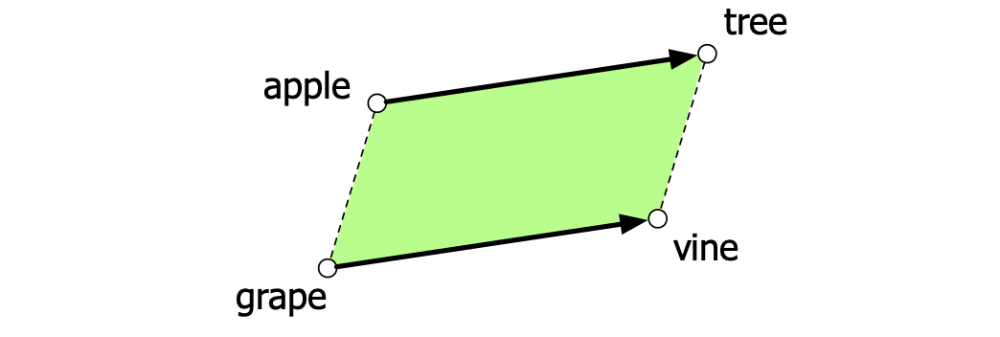
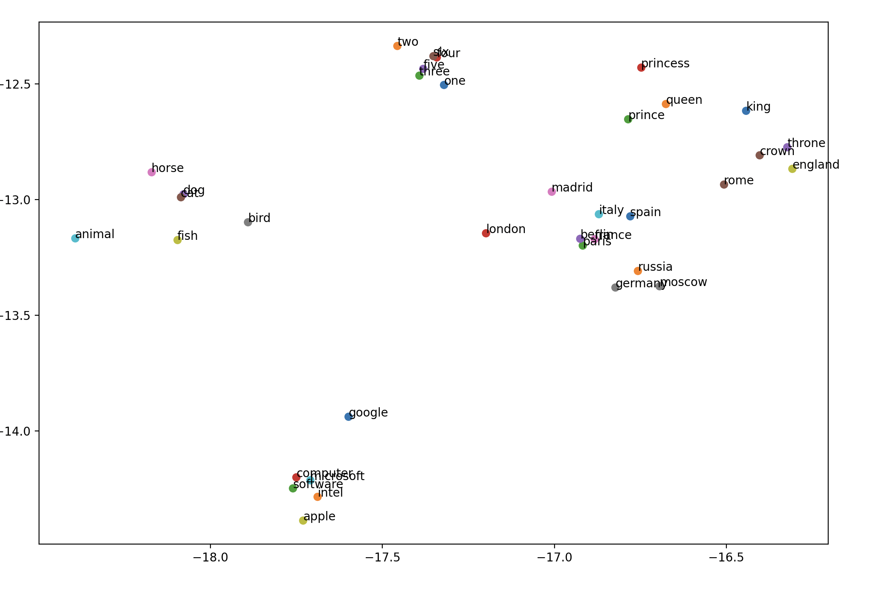

# Word2Vec

### About:

### Set-up:

Run the main.py file, which contains the pre-processing pipeline and core training loop.
N.B. All tunable hyperparameters live within the config.py file. 

### Evaluation:

We observe the model's performacne with 3 example metrics:

1) n-nearest neighbours: Using a user-chosen word, find its n nearest neighbours in 
the embedding space.

2) Parallelogram mode: Using three given words, find the word4 whose analgous relationship
with word3 matches that between words1 and word2 with word3. E.g. paris is to france,
as berlin is to "X". See below:

*Adapted from Jurafsky & Martin, Speech and Language Processing (3rd ed. draft), Fig. 5.8.*
https://web.stanford.edu/~jurafsky/slp3/5.pdf

3) t-SNE: Projecting the higher dimension embeddings data onto a 2d graph focusing
specifically on a list of chosen words.

For the following words, the plot is as follows:

`words = [
    "king", "queen", "prince", "princess", "throne", "crown",
    "france", "germany", "england", "italy", "spain", "russia",
    "paris", "london", "berlin", "rome", "madrid", "moscow",
    "apple", "microsoft", "google", "intel", "software", "computer",
    "dog", "cat", "horse", "bird", "fish", "animal",
    "one", "two", "three", "four", "five", "six"
]
`

### References & Acknowledgements
This is a canonical implementation of skip-gram Word2Vec as delineated in
Chapter 5, Embeddings Speech and Language Processing by Jurafsky & Martin. 
